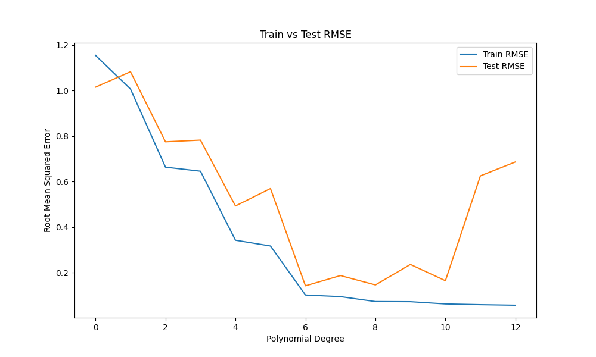
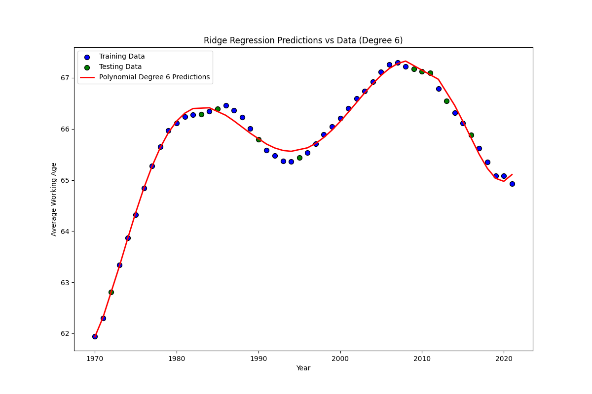

# Polynomial Fitting with Ridge Regression

This repository contains a Python script for polynomial fitting with Ridge Regression using K-Fold cross-validation to determine the best polynomial degree. The script evaluates the model performance using RMSE (Root Mean Squared Error) on both training and testing datasets.

## Table of Contents

- [Installation](#installation)
- [Usage](#usage)
- [Results](#results)
- [Figures](#figures)
- [License](#license)

## Installation

### Clone the Repository

To clone the repository, use the following command:

```bash
git clone https://github.com/jberthiaume24/Polynomial-Fitting-with-Ridge-Regression.git
cd Polynomial-Fitting-with-Ridge-Regression
```

### Set Up a Python Virtual Environment

#### macOS and Linux

1. **Install Python and `pip` (if not already installed):**

   ```bash
   sudo apt-get install python3 python3-pip  # For Linux
   brew install python3                      # For macOS
   ```

2. **Create a virtual environment:**

   ```bash
   python3 -m venv venv
   ```

3. **Activate the virtual environment:**

   ```bash
   source venv/bin/activate
   ```

4. **Install dependencies:**

   ```bash
   pip install -r requirements.txt
   ```

#### Windows

1. **Install Python and `pip` (if not already installed):**

   Download and install Python from [python.org](https://www.python.org/downloads/).

2. **Create a virtual environment:**

   ```cmd
   python -m venv venv
   ```

3. **Activate the virtual environment:**

   ```cmd
   venv\Scripts\activate
   ```

4. **Install dependencies:**

   ```cmd
   pip install -r requirements.txt
   ```

### `requirements.txt`

Here is a sample `requirements.txt` file that includes the necessary Python packages for this project:

```
numpy
pandas
matplotlib
scikit-learn
```

## Usage

1. **Place your data files** (`train.dat` and `test.dat`) in the repository directory.

2. **Run the script:**

   ```bash
   python script_name.py
   ```

   Replace `script_name.py` with the actual name of your Python script file.

## Results

The script performs polynomial fitting using Ridge Regression and evaluates the model's performance. It selects the best polynomial degree based on RMSE values obtained through K-Fold cross-validation. 

### Commentary on Findings

The script generates the following outputs:

1. **KFold Cross-Validation Results**: A table showing the RMSE for various polynomial degrees for both training and testing datasets. This helps in understanding how the model's performance varies with the polynomial degree and aids in selecting the best degree.

2. **Final Model Results**: The final model's RMSE on both the training and testing datasets, along with the coefficients of the polynomial features for the selected degree.

## Figures

### Train vs Test RMSE



This plot shows how the Root Mean Squared Error (RMSE) varies with different polynomial degrees. The "Train RMSE" curve indicates how well the model fits the training data, while the "Test RMSE" curve shows the model's performance on unseen data. A lower RMSE indicates a better fit. The optimal polynomial degree is where the "Test RMSE" is minimized.

### Ridge Regression Predictions vs Data



This plot visualizes the Ridge Regression predictions versus the actual training and testing data for the best polynomial degree. The red line represents the fitted polynomial model, showing how well it captures the underlying pattern of the data.